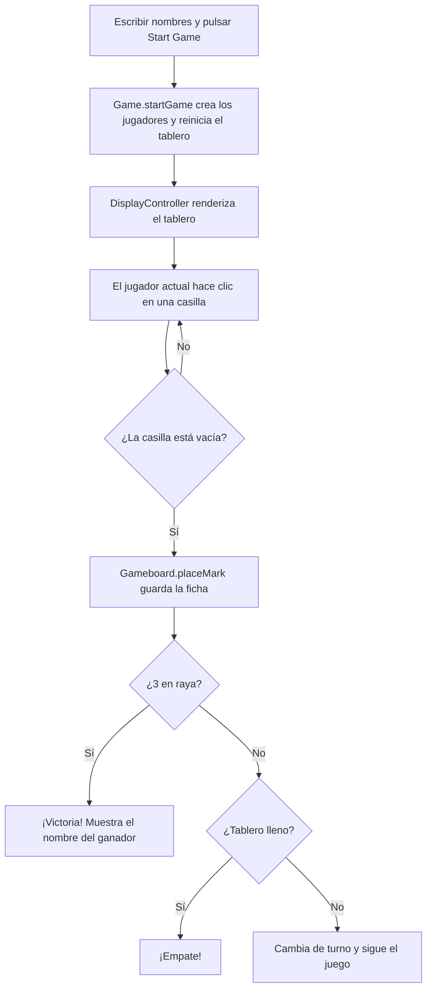

<div align="center">

# ⭕ Tic-Tac-Toe

**Tres en raya en el navegador con JavaScript puro y patrón módulo** — proyecto del curso de [The Odin Project](https://www.theodinproject.com/).

[](https://developer.mozilla.org/es/docs/Web/HTML)
[](https://developer.mozilla.org/es/docs/Web/CSS)
[](https://developer.mozilla.org/es/docs/Web/JavaScript)
[](https://www.theodinproject.com/)

</div>

---

## ✨ Características

- 🎮 **Juego de dos jugadores** local, por turnos, con marcador X y O
- 🧱 **Patrón módulo (IIFE)** para `Gameboard`, `Game` y `DisplayController`, y **factory** para los jugadores — mínimo código global
- 🏁 **Detección de victoria** con las 8 combinaciones ganadoras y de **empate** cuando el tablero se llena
- 🚫 Lógica que **impide jugar en casillas ocupadas** (la casilla simplemente ignora el clic)
- 👤 **Nombres personalizables** para cada jugador
- 🔄 Botón **Start Game** que inicia y reinicia la partida
- 📢 **Mensaje de resultado** al finalizar: `"Nombre gana!"` o `"¡Es un empate!"`
- 🖱️ **Vista previa fantasma** de la ficha del jugador actual al pasar el ratón sobre casillas vacías
- 🎨 Tema oscuro con fichas **rojo (`#ff6b6b`) y azul (`#4dabf7`)**, tablero en grid con esquinas redondeadas

---

## 🚀 Cómo ejecutarlo

No requiere instalación ni dependencias. Simplemente:

1. Clona el repositorio:

```bash
git clone https://github.com/tu-usuario/tic-tac-toe.git
cd tic-tac-toe
```

2. Abre `index.html` en tu navegador (o usa Live Server en VS Code).

---

## 📁 Estructura del proyecto

```
tic-tac-toe/
├── 📄 index.html     # Estructura: título, inputs de nombres, tablero, botón y estado
├── 🎨 styles.css     # Estilos (tema oscuro, grid del tablero, hover fantasma)
└── ⚙️ script.js      # Lógica (módulos Gameboard, Game, DisplayController y factory Player)
```

---

## 🧠 Cómo funciona

Toda la lógica vive en `script.js` organizada en módulos, siguiendo el objetivo del proyecto de **tener la menor cantidad posible de código global**:

| Módulo            | Tipo          | Responsabilidad                                            |
|-------------------|---------------|------------------------------------------------------------|
| `Gameboard`       | IIFE          | Array privado de 9 casillas + `placeMark`, `getBoard`, `reset` |
| `createPlayer`    | Factory       | Crea jugadores con `name` y `mark`                         |
| `Game`            | IIFE          | Flujo del juego: turnos, `playRound`, victoria, empate     |
| `DisplayController` | IIFE        | Render del tablero, eventos de clic, inputs y resultados   |

Como solo necesitamos **una única instancia** de cada uno, `Gameboard`, `Game` y `DisplayController` se envuelven en un **IIFE (module pattern)** que devuelve solo los métodos necesarios; `createPlayer` es una **factory** porque sí necesitamos crear varios jugadores.

### Flujo de una partida



### Lógica clave: `playRound`

```js
const playRound = (index) => {
    if (!active || !Gameboard.placeMark(index, currentPlayer.mark)) return;

    if (checkWinner()) {
        active = false;
        DisplayController.endGame(`${currentPlayer.name} wins!`);
    } else if (checkTie()) {
        active = false;
        DisplayController.endGame("It's a tie!");
    } else {
        switchPlayer();
        DisplayController.renderTurn();
    }
    DisplayController.renderBoard();
};
```

La victoria se comprueba contra las 8 combinaciones ganadoras (3 filas, 3 columnas y 2 diagonales):

```js
const WINNING_COMBOS = [
    [0, 1, 2], [3, 4, 5], [6, 7, 8],
    [0, 3, 6], [1, 4, 7], [2, 5, 8],
    [0, 4, 8], [2, 4, 6],
];
```

---

## 🛠️ Tecnologías

- **HTML5** — estructura semántica y formulario de nombres
- **CSS3** — CSS Grid para el tablero, flexbox, transiciones y estados hover
- **JavaScript (Vanilla JS)** — IIFE (module pattern), factory functions, closures y manipulación del DOM

---

## 📚 Objetivos de aprendizaje

- **Patrón módulo (IIFE)** para encapsular estado y exponer solo una interfaz mínima
- **Factory functions** para crear instancias de jugadores
- **Cero variables globales**: todo el estado vive dentro de los módulos
- Separar la **lógica del juego** (`Game`/`Gameboard`) de la **lógica de presentación** (`DisplayController`)
- Diseñar la API interna: módulos que se comunican entre sí mediante métodos públicos (`Gameboard.placeMark`, `Game.playRound`, `DisplayController.renderBoard`)

---

## 📚 Créditos

Proyecto realizado como parte del curso [Foundations](https://www.theodinproject.com/paths/foundations) de **The Odin Project** — el mejor sitio para aprender desarrollo web de forma gratuita.

---

<div align="center">

⭐ **Si te gusta, dale una estrella al repositorio**

</div>
