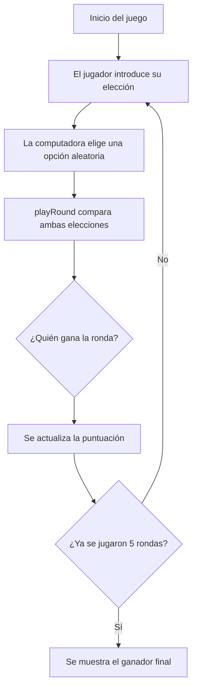

# Rock Paper Scissors

<p align="center">
	<strong>Un juego clásico de navegador hecho con JavaScript básico.</strong><br>
	El objetivo es practicar funciones, condicionales, bucles y lógica de juego.
</p>

<p align="center">
	
	
</p>

---

## Vista General

Este proyecto implementa una versión sencilla de **rock, paper, scissors** donde:

- la computadora elige una opción al azar;
- el jugador introduce su elección con `prompt()`;
- cada ronda compara ambas respuestas;
- al final de 5 rondas se muestra el ganador de la partida.

---

## Cómo Funciona



---

## Funciones Principales

| Función | Qué hace |
| --- | --- |
| `getComputerChoice()` | Genera una elección aleatoria entre `rock`, `paper` y `scissors`. |
| `getHumanChoice()` | Pide al jugador su elección usando `prompt()`. |
| `playRound()` | Compara la elección humana con la de la computadora y decide el ganador de una ronda. |
| `playGame()` | Ejecuta 5 rondas, lleva la puntuación y muestra el resultado final. |

---

## Cómo Ejecutarlo

1. Abre el archivo `index.html` en el navegador.
2. Asegúrate de que `game.js` esté enlazado correctamente.
3. Responde al `prompt()` con una de estas opciones:
	 - `rock`
	 - `paper`
	 - `scissors`

> Importante: este juego usa `prompt()` y `alert()`, así que debe ejecutarse en el navegador, no en Node.js.

---

## Estructura del Proyecto

```text
rock-paper-scissors/
├── index.html
├── game.js
└── README.md
```

---

## Objetivos de Aprendizaje

Este proyecto ayuda a practicar:

- funciones;
- condicionales `if / else`;
- bucles `for`;
- variables para puntuación;
- lógica de control de flujo;
- interacción básica con el navegador.

---

## Posibles Mejoras

- Validar que el usuario solo escriba opciones válidas.
- Hacer el juego con botones en lugar de `prompt()`.
- Mostrar la puntuación en la página con HTML y CSS.
- Añadir una interfaz más visual para jugar sin alertas.

---

## Estado

Proyecto en desarrollo como parte del aprendizaje de JavaScript básico.
